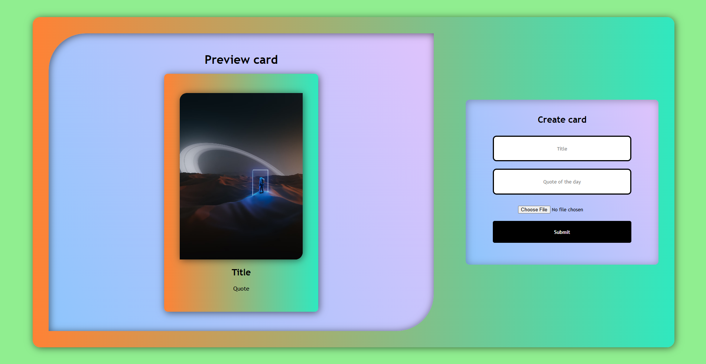

# Web02 - DOM Practice

## Overview
Web02 is a simple web project focused on practicing **DOM manipulation** using HTML, CSS, and JavaScript. It allows users to dynamically create and preview a card with a title, quote, and an image.

## Features
- **Preview Section**: Displays a card with a title, quote, and image.
- **Create Section**: Users can enter a title, quote, and upload an image.
- **Real-time Image Preview**: The selected image is displayed instantly.
- **Dynamic Content Update**: Clicking the submit button updates the preview card.

## File Structure
- **index.html**: Defines the structure of the web page.
- **style.css**: Adds styling and layout to the webpage.
- **script.js**: Implements the DOM manipulation logic.

## Technologies Used
- **HTML5** for structuring the webpage.
- **CSS3** for styling with gradients and responsive layout.
- **JavaScript** for handling user input and updating the DOM dynamically.

## How It Works
1. Users enter a **title** and **quote** in the input fields.
2. Users select an image using the **file input**.
3. The image preview updates instantly.
4. Clicking the **submit button** updates the card's content dynamically.

## Usage
1. Clone the repository:
   ```bash
   git clone <repository-url>
   ```
2. Open `index.html` in a browser.
3. Fill in the details and see the updates in real time.

## Screenshot


## Author
**Sharwan Jung Kunwar**

