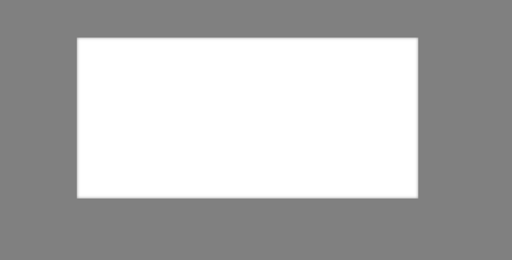

# CSS Animation with GSAP

This project showcases a dynamic **CSS animation** using **GSAP (GreenSock Animation Platform)**. It features a responsive rectangular box that changes color based on **mouse movement**.

## ✨ Features:
- Smooth **color transition** using GSAP.
- Interactive response to **mouse position** inside the rectangle.
- Resets to the original color on **mouse leave**.
- **Fully responsive** design with a modern UI.

## 🛠️ Technologies Used:
- **HTML, CSS** for structure & styling.
- **GSAP (GreenSock)** for smooth animations.
- **JavaScript** for event-driven interactions.

## **Screenshots:**

🚀 **Try it out and enhance your web animations with GSAP!**
