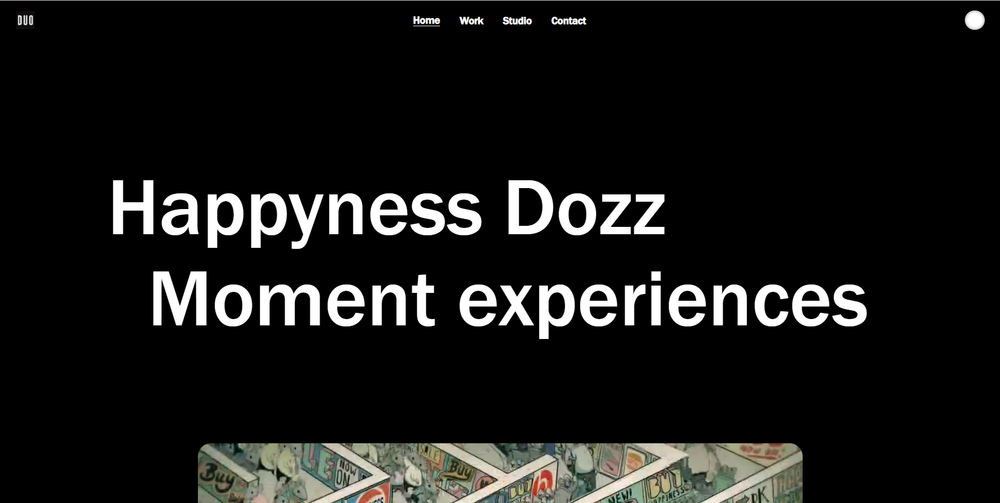
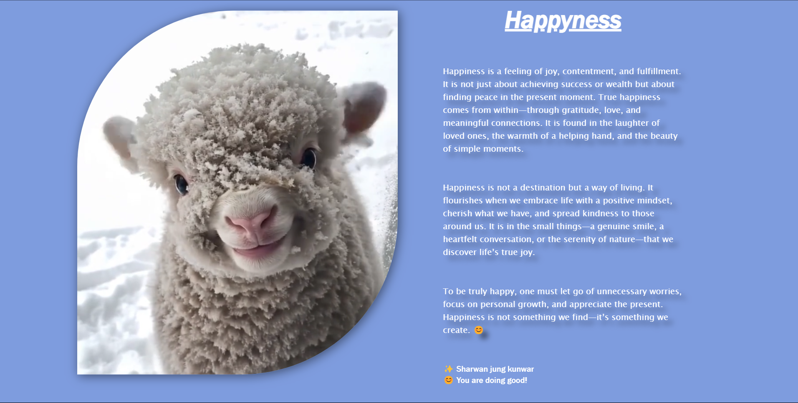

# 🎉 Happyness 

Happyness Dozz is a visually engaging webpage that focuses on happiness and positive experiences. It utilizes **HTML, CSS, and JavaScript**, integrating **GSAP** and **Locomotive Scroll** for smooth scrolling and animations.


### **ScreenShots**



## 🌟 Key Features

### 🚀 Navigation Bar
- Contains a **logo** and **navigation links** (Home, Work, Studio, Contact).
- Features an **interactive circular button**.

### 📜 Page Layout
#### **Page 1**
- Displays a large **heading** (`Happyness Dozz`) and a **subheading** (`Moment experiences`).
- A **background video** (`happyness.mp4`) enhances the visual appeal.

#### **Page 2**
- Two sections:
  - A **video** (`Happyness01.mp4`) inside a **rounded, shadowed box**.
  - A **text block** discussing **happiness** and encouraging a **positive mindset**.
  - Includes a **motivational message** with the author's name (**Sharwan Jung Kunwar**).

## 🎨 Styling (CSS)
- **Dark theme** (`background-color: black`) for the main section.
- **Navigation bar** is neatly aligned using `flexbox`.
- **Headings and videos** are centered and dynamically positioned.
- **Page 2** has a **blue-toned background**, **text shadows**, and **smooth borders** on video sections.

## 🎬 JavaScript Animations (GSAP & Locomotive Scroll)
- **Smooth scrolling effect** applied using **Locomotive Scroll**.
- **Scroll-triggered animations**:
  - The **heading text moves sideways** as the user scrolls.
  - The **video scales dynamically** (`width: 90%`).

## 📂 Project Structure
```
📁 happyness-dozz
│-- 📄 index.html
│-- 📄 styles.css
│-- 📄 script.js
│-- 📂 assets
│   │-- 🎥 happyness.mp4
│   │-- 🎥 Happyness01.mp4
│   │-- 📷 logo.png
```

## 🛠️ Technologies Used
- **HTML5**
- **CSS3** (Flexbox, Shadows, Animations)
- **JavaScript (GSAP, Locomotive Scroll)**
- **Responsive Design**

## 📌 How to Use
1. Clone this repository:
   ```sh
   git clone https://github.com/your-username/happyness-dozz.git
   ```
2. Navigate to the project folder:
   ```sh
   cd happyness-dozz
   ```
3. Open `index.html` in your browser.

## 🤝 Contributing
Feel free to fork this repository, submit pull requests, or report any issues. Let's spread positivity! 😊

## 📜 License
This project is licensed under the **MIT License**.

---

🚀 Created with ❤️ by **Sharwan Jung Kunwar**
