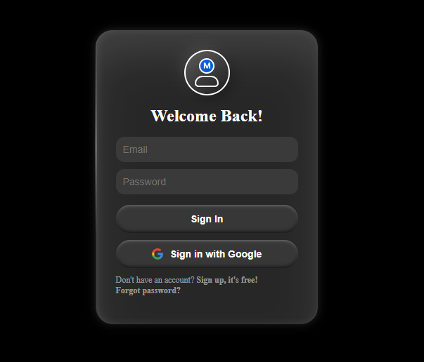

# **Login Page**

## **Description**
The provided code is a login page that includes email and password input fields, a "Sign In" button, and an option to sign in using Google. The page has a modern, dark-themed UI with smooth shadows, glassmorphism effects, and interactive elements.

## **Screenshot**

### **HTML**
- Defines the structure of the login page.
- Includes a logo, a welcome message, input fields for email and password, and two sign-in buttons (one for email/password and one for Google login).
- The Google Sign-In button has an SVG Google icon.
- Links for "Sign Up" and "Forgot Password" are also included.

### **CSS**
- Uses flexbox for centering elements.
- Implements glassmorphism effects for a semi-transparent login box with a blurred background.
- Defines a dark theme using variables for colors.
- Adds hover effects for buttons and inputs.
- Uses keyframes animation for a subtle rotating gradient effect in the background.

## **Summary**
The code creates a modern login page with a dark theme and glassmorphism UI, featuring email/password login and Google sign-in options, smooth animations, and a responsive layout.
